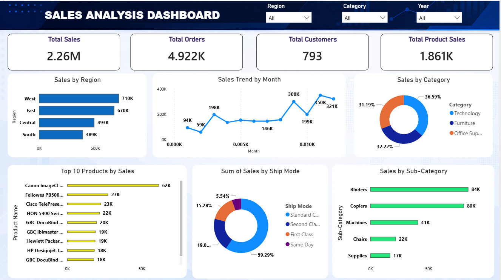

**# 📊 Sales Analysis Dashboard using Python, SQL \& Power BI**


**## 📌 Project Overview**


This project focuses on analysing retail sales data to uncover valuable business insights related to

sales performance, profit trends, customer behaviour, and regional performance.


**The complete workflow includes:**


\- Data Cleaning using Python \& Pandas

\- SQL Analysis using MySQL

\- Interactive Dashboard Creation using Power BI


This project simulates a real-world Data Analyst workflow from raw data processing to business intelligence reporting.


\---


**# 🚀 Objectives**


\- Clean and pre-process raw sales data

\- Perform business analysis using SQL

\- Practice advanced SQL concepts including Window Functions

\- Build an interactive Power BI dashboard

\- Generate actionable business insights


\---


**# 🛠️ Tools \& Technologies Used**


| Tool | Purpose |

|------|----------|

| Python | Data Cleaning \& Pre-processing |

| Pandas | Data Manipulation |

| NumPy | Numerical Operations |

| MySQL | SQL Analysis |

| Power BI | Dashboard \& Visualization |

| DAX | KPI Calculations |

| Jupyter Notebook | Development Environment |


\---


**# 📂 Project Workflow**


**## 1️⃣ Data Cleaning using Python**


Performed multiple pre-processing steps using Pandas:

\- Handled missing values

\- Removed duplicate records

\- Converted date columns into datetime format

\- Extracted Year and Month from Order Date

\- Removed unnecessary columns

\- Performed exploratory analysis


**### Python Concepts Used**


\- Data Frames

\- Group By

\- Datetime Conversion

\- Null Handling

\- Aggregation Functions


\---


**## 2️⃣ SQL Analysis using MySQL**


Imported cleaned dataset into MySQL and performed business analysis queries.


**### SQL Concepts Used**

\- Aggregate Functions

\- GROUP BY

\- ORDER BY

\- CTE (Common Table Expressions)

\- Window Functions

\- Ranking Functions

\- Running Totals


**### Window Functions Practiced**

\- ROW\_NUMBER()

\- RANK()

\- DENSE\_RANK()

\- LEAD()

\- LAG()

\- FIRST\_VALUE()

\- LAST\_VALUE()

\- NTILE()

\- SUM() OVER()


\---


**# 📈 Business Analysis Performed**


\- Region-wise Sales Analysis

\- Category-wise Profit Analysis

\- Top 10 Products by Sales

\- Monthly Sales Trend

\- Customer Sales Analysis

\- Running Total Analysis

\- Profit Margin Analysis


\---


**# 📊 Power BI Dashboard Features**


The dashboard includes:

\- KPI Cards

\- Region-wise Sales Analysis

\- Monthly Sales Trend

\- Category-wise Sales Distribution

\- Top Products Analysis

\- Profit Analysis

\- Interactive Slicers \& Filters

\- DAX Measures


**### KPIs Added**

\- Total Sales

\- Total Profit

\- Total Orders

\- Total Customers


\---


**# 💡 Key Business Insights**


\- West region generated the highest sales and profit.

\- Technology category contributed maximum revenue.

\- Sales peaked during year-end months.

\- Certain products generated high sales but low profitability.

\- Customer purchasing patterns varied across regions.


\---


**🎯 Learning Outcomes**


**Through this project, I gained practical experience in:**


\- Data Cleaning

\- SQL Query Writing

\- Window Functions

\- Business Intelligence Reporting

\- Dashboard Design

\- Data Visualization

\- Business Insight Generation


**📌 Future Improvements**


\- Add Forecasting Analysis

\- Implement Customer Segmentation

\- Add Advanced DAX Calculations

\- Connect Dashboard with Live Database


***👨‍💻 Author***


***-Ahmad Raja Khan***

***-Aspiring Data Analyst***


**⭐ Conclusion**


\-This project demonstrates an end-to-end Data Analytics workflow involving data pre-processing, SQL analysis,

\-and interactive dashboard reporting to support data-driven business decisions.


\---


\## Dashboard Preview





**# 📁 Project Structure**


**```text**

**Sales Project**

**│**

**├── Dataset**

**│   └── cleaned\_sales\_data.csv**

**│**

**├── Python**

**│   └── sales\_analysis.ipynb**

**│**

**├── SQL**

**│   └── sales\_queries.sql**

**│**

**├── PowerBI**

**│   └── sales\_dashboard.pbix**

**│**

**├── Screenshots**

**│   └── dashboard.png**

**│**

**└── README.md**

